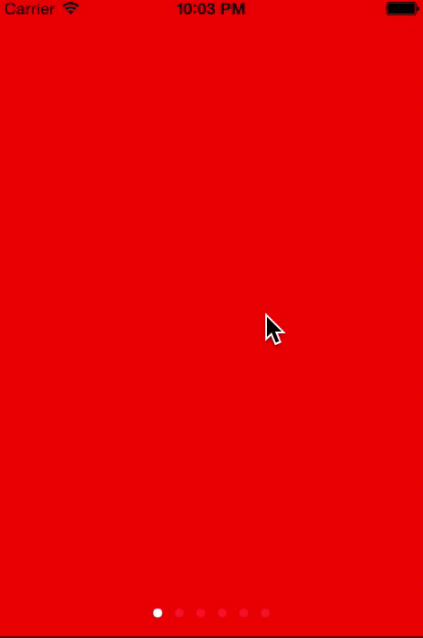

MAPageViewController
==================

MAPageViewController is a simple wrapper around the most common boiler-plate UIPageViewController setup.


Usage
=====

Simply initilize a MAPageViewController with an array of view controllers, and treat it like any other UIPageViewController, add it as root view controller of your project, wrap it in a navigation controller and present it modally, or do anything else with it that you could do with a view controller.


Swift
=====

```js
let redVC: UIViewController = UIViewController()
redVC.view.backgroundColor = UIColor.redColor()

let blueVC: UIViewController = UIViewController()
blueVC.view.backgroundColor = UIColor.blueColor()

let greenVC: UIViewController = UIViewController()
greenVC.view.backgroundColor = UIColor.greenColor()

let orangeVC: UIViewController = UIViewController()
orangeVC.view.backgroundColor = UIColor.orangeColor()

let brownVC: UIViewController = UIViewController()
brownVC.view.backgroundColor = UIColor.brownColor()

let yellowVC: UIViewController = UIViewController()
yellowVC.view.backgroundColor = UIColor.yellowColor()

let viewControllers: UIViewController[] = [redVC, blueVC, greenVC, orangeVC, brownVC, yellowVC]
self.window!.rootViewController = MAPageViewController(viewControllers: viewControllers)

```

Objective-C
=====

```js
UIViewController *redVC = [UIViewController new];
redVC.view.backgroundColor = [UIColor redColor];

UIViewController *blueVC = [UIViewController new];
blueVC.view.backgroundColor = [UIColor blueColor];

UIViewController *greenVC = [UIViewController new];
greenVC.view.backgroundColor = [UIColor greenColor];

UIViewController *orangeVC = [UIViewController new];
orangeVC.view.backgroundColor = [UIColor orangeColor];

UIViewController *brownVC = [UIViewController new];
brownVC.view.backgroundColor = [UIColor brownColor];

UIViewController *yellowVC = [UIViewController new];
yellowVC.view.backgroundColor = [UIColor yellowColor];

NSArray *viewControllers = @[redVC, blueVC, greenVC, orangeVC, brownVC, yellowVC];
self.window.rootViewController = [[MAPageViewController alloc] initWithViewControllers:viewControllers];

```





License
=====

This project is made available under the MIT license. See LICENSE.txt for details.
